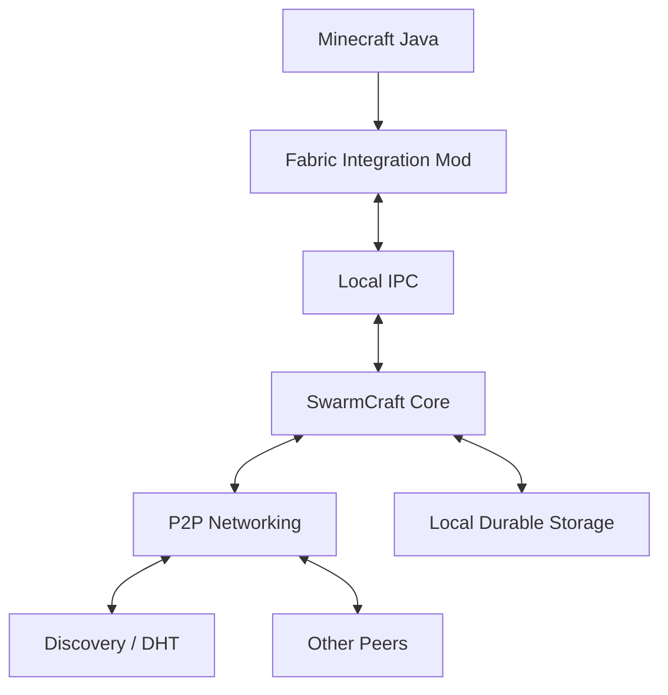

# SwarmCraft Architecture

## 1. Purpose

SwarmCraft is designed to separate the **identity and persistence of a Minecraft world** from any permanent server process.

The first architecture target is not distributed Minecraft simulation.

It is:

> replicated world storage + automatic authority migration + verifiable history.

This gives the project a realistic path toward decentralization without immediately requiring Minecraft itself to become a fully distributed simulation engine.

---

## 2. System layers



### Minecraft integration

Responsibilities:

- observe relevant world/server events;
- produce deterministic operations where possible;
- request world restoration;
- apply accepted state;
- coordinate save barriers;
- start/stop the local integrated/dedicated server role;
- expose Minecraft version and mod compatibility metadata.

It should avoid implementing:

- peer discovery;
- cryptographic identity;
- consensus;
- durable replicated logs;
- NAT traversal;
- world-history validation.

Those belong in the core.

### SwarmCraft core

Responsibilities:

- peer identity;
- world identity;
- networking;
- protocol negotiation;
- snapshot exchange;
- append-only history;
- signatures;
- authority election;
- replication bookkeeping;
- crash recovery;
- compatibility checks;
- local persistence;
- integrity validation.

---

## 3. Process model

A peer may run two processes:

```text
Minecraft JVM
    |
    | Unix socket / named pipe / localhost QUIC
    v
SwarmCraft daemon
```

The daemon can optionally remain running when Minecraft is closed.

That creates an important future capability:

```text
Minecraft: OFF
SwarmCraft daemon: ON
```

The machine can still:

- seed snapshots;
- answer peer discovery;
- replicate history;
- verify data;
- provide relay assistance if configured.

---

## 4. Peer identity

Each installation creates a long-lived cryptographic identity.

Conceptually:

```text
PeerIdentity {
    public_key
    private_key
    peer_id = hash(public_key)
}
```

The private key never leaves the machine unless the user deliberately exports it.

Recommended primitive:

- Ed25519 for signatures.

The protocol should avoid treating IP addresses as identities.

---

## 5. World identity

A world should have an identity independent of any peer.

Possible model:

```text
WorldGenesis {
    protocol_version
    minecraft_version
    world_seed_commitment
    initial_rules
    initial_membership_policy
    created_at
    creator_public_key
    nonce
}
```

Then:

```text
world_id = BLAKE3(canonical_encode(WorldGenesis))
```

The creator should not remain a permanent authority merely because they created the genesis record.

Creation authority and runtime authority are different concepts.

---

## 6. World state model

Minecraft worlds are too large to resend after every event.

Use layers:

```text
snapshot
   +
ordered operations after snapshot
   =
current state
```

Example:

```text
Snapshot #80
  |
  +-- op 80001
  +-- op 80002
  +-- op 80003
  ...
  +-- op 80742
```

Periodically, a new snapshot compacts the history.

A peer joining late can:

1. fetch the newest trusted snapshot;
2. verify its hash;
3. fetch operations after the snapshot;
4. replay or apply them;
5. compare resulting state hash/checkpoints.

---

## 7. Snapshot structure

A snapshot should be content-addressed.

Possible conceptual structure:

```text
SnapshotManifest {
    world_id
    snapshot_id
    parent_snapshot
    epoch
    minecraft_version
    protocol_version
    region_entries[]
    metadata_hash
    state_root
    created_by
    signature
}
```

Large region data should be split into chunks/blobs:

```text
blob_id = BLAKE3(compressed_blob)
```

This enables torrent-like deduplication and distribution.

Peers can request missing blobs from multiple sources.

---

## 8. History structure

State transitions should form a hash-linked sequence inside an authority epoch.

```text
Operation {
    world_id
    epoch
    sequence
    previous_hash
    payload
    author
    timestamp_hint
    signature
}
```

Important:

Wall-clock timestamps must not define canonical ordering.

Canonical ordering should use protocol-controlled sequence numbers / logical ordering.

---

## 9. Authority epochs

Whenever authority changes, create a new epoch.

```text
Epoch 41
authority = Alice

Epoch 42
authority = Bob

Epoch 43
authority = Charlie
```

An epoch record should establish:

- previous epoch;
- new authority;
- reason;
- supporting votes/leases/proofs;
- last committed state;
- protocol version.

This makes host migration visible and auditable.

---

## 10. Authority is not ownership

The active authority may:

- order Minecraft operations;
- publish checkpoints;
- coordinate snapshots;
- act as the current simulation host.

It must not be allowed to:

- rewrite accepted history;
- silently alter membership rules;
- invalidate old snapshots arbitrarily;
- impersonate other peers;
- claim a different world identity.

Authority is temporary execution power, not permanent control.

---

## 11. Authority election

The exact algorithm should remain modular during early development.

Possible MVP model:

### Small trusted swarm

For worlds shared among friends:

- current peers know the allowed membership set;
- use leases;
- require confirmations when multiple peers are reachable;
- deterministic tie-breaking;
- record all transitions.

A simplified election could rank eligible peers by:

1. valid latest state;
2. protocol compatibility;
3. snapshot completeness;
4. stable connectivity;
5. deterministic peer-ID tie break.

Do not use "highest wall-clock timestamp wins."

---

## 12. Solo authority

A real Minecraft world must work with one player.

When exactly one valid peer is available:

```text
peer becomes SoloAuthority
```

The history should mark this state explicitly.

Example:

```text
EpochMode:
- Quorum
- Solo
```

This allows future peers to understand that progress occurred without replication.

Solo progress can still be canonical, but it has lower durability until replicated.

---

## 13. Commit levels

It is useful to describe durability explicitly.

Example:

```text
LOCAL
  stored durably by authority

REPLICATED
  stored by at least N peers

QUORUM
  acknowledged by required active quorum

SNAPSHOTTED
  included in immutable snapshot
```

These are not necessarily consensus states.

They are useful observability states for users and tests.

A UI might show:

```text
World safety: 3 replicas
Latest snapshot: 14 seconds ago
Authority: Mousa-PC
Epoch mode: quorum
```

---

## 14. Network partitions

Consider five peers:

```text
A B C | D E
```

A network split creates two groups.

If both sides keep writing authoritative history, the world forks.

For the initial protocol, prefer a CP-style policy:

> preserve one canonical history, even if some peers temporarily cannot play.

Possible behavior:

- side with valid authority lease/quorum continues;
- minority side does not advance canonical state;
- minority may spectate local cached state;
- when the partition heals, minority syncs.

Exact quorum rules become difficult when many configured members are offline, so active-membership and lease semantics require careful design.

---

## 15. Split-brain prevention

Potential tools:

- short authority leases;
- signed epoch records;
- monotonic sequence numbers;
- quorum certificates;
- deterministic election rules;
- fencing tokens.

A fencing token is especially useful.

Example:

```text
epoch 42 => token 42
epoch 43 => token 43
```

Peers reject writes from stale authority token `42` after epoch `43` is accepted.

---

## 16. Storage engine

The daemon needs durable local storage.

Logical stores:

```text
identity/
worlds/
  <world-id>/
    metadata
    snapshots
    blobs
    log
    peer-state
    recovery
```

Candidate technologies:

- redb;
- RocksDB;
- SQLite for some metadata;
- flat content-addressed blob storage.

Avoid committing to one engine before benchmark/recovery tests.

---

## 17. Blob distribution

Snapshot blobs are ideal for BitTorrent-like transfer behavior.

A joining peer can obtain different blobs from different peers:

```text
Region blob A <- Alice
Region blob B <- Bob
Region blob C <- Charlie
```

Benefits:

- parallel download;
- reduced load on authority;
- natural swarm behavior;
- content verification through hashes.

The canonical manifest defines which blobs make up a snapshot.

---

## 18. Compression

Minecraft region data compresses well.

Recommended research target:

- Zstandard.

Compression should happen before hashing if the compressed representation itself is canonical, or after hashing if the uncompressed canonical payload is authoritative.

Pick one rule and never make it ambiguous.

---

## 19. Networking

Recommended research stack:

- Rust Tokio;
- QUIC;
- libp2p where useful;
- Kademlia DHT;
- mDNS for LAN discovery;
- hole punching;
- optional relays.

Protocol concerns:

- multiplexing;
- backpressure;
- large blob transfer;
- cancellation;
- resumable downloads;
- rate limits;
- peer scoring;
- NAT traversal;
- connection migration.

---

## 20. Discovery

Discovery must not become authority.

Safe model:

```text
Bootstrap server:
"Here are peers who claim to know World X."

NOT:

"Here is the official state of World X."
```

Possible discovery sources:

- local mDNS;
- cached peers;
- DHT;
- user-provided peer address;
- optional bootstrap nodes;
- QR/share links;
- DNS records.

A world must remain recoverable without a specific discovery provider if peers can find one another another way.

---

## 21. Relays

Some peers will be behind difficult NATs.

Optional relays may carry encrypted traffic.

A relay must not become:

- world authority;
- trusted state storage;
- required identity provider.

Multiple community relays should be possible.

---

## 22. Minecraft save barriers

Minecraft may mutate many files during save.

The integration layer needs a clean consistency boundary.

Possible strategy:

1. request Minecraft save;
2. pause mutation or establish tick boundary;
3. flush region/player/state data;
4. produce snapshot staging view;
5. hash content;
6. release gameplay;
7. compress/distribute snapshot asynchronously.

Do not copy arbitrary world files while they are actively being mutated without understanding Minecraft's save behavior.

---

## 23. Operation-level vs snapshot-level replication

There are two broad approaches.

### A. Snapshot replication

Replicate world files/checkpoints.

Advantages:

- easier MVP;
- closer to Minecraft storage;
- less invasive.

Disadvantages:

- larger updates;
- weaker real-time failover;
- potentially more progress loss.

### B. Operation replication

Replicate deterministic gameplay operations.

Advantages:

- fine-grained;
- low-latency failover;
- stronger audit history.

Disadvantages:

- much harder;
- mod compatibility;
- nondeterministic Minecraft behavior;
- enormous protocol surface.

Recommended progression:

```text
MVP: snapshot + save journal
V2: important operation journal
V3+: deeper deterministic replication
```

---

## 24. Compatibility

World metadata should declare:

- Minecraft version;
- loader;
- mod list fingerprint;
- datapack fingerprint;
- protocol version.

Joining peers should not become authority with incompatible simulation code.

A mismatch should fail clearly rather than silently corrupt the world.

---

## 25. Update strategy

Protocol changes need explicit versioning.

Never assume all peers update simultaneously.

Support:

- protocol negotiation;
- minimum compatible version;
- migration rules;
- snapshot format versions;
- feature flags.

---

## 26. Observability

A developer mode should expose:

```text
world ID
peer ID
current epoch
authority
authority mode
latest committed sequence
latest local sequence
replica count
snapshot ID
connected peers
blob availability
partition status
protocol version
```

Debuggability is a core feature in distributed systems.

---

## 27. Failure tests

The project should test failure before optimizing performance.

Automated scenarios:

- kill authority process;
- kill authority machine;
- disconnect network;
- introduce packet loss;
- duplicate messages;
- reorder messages;
- reconnect stale peer;
- corrupt local blob;
- delete latest snapshot;
- fill disk;
- simulate clock skew;
- downgrade client;
- split 5 peers into 3/2;
- split 2 peers into 1/1;
- authority crash during snapshot;
- crash during epoch transition.

---

## 28. Future distributed simulation

Only after robust host migration exists should SwarmCraft explore region authority.

Example:

```text
Region A -> Peer 1
Region B -> Peer 2
Region C -> Peer 3
```

Challenges:

- entities crossing boundaries;
- redstone crossing boundaries;
- explosions;
- pistons;
- chunk tickets;
- mob AI;
- projectiles;
- portals;
- global game rules;
- raids;
- weather;
- scoreboard;
- commands.

This is effectively a separate research problem.

---

## 29. Architectural north star

A SwarmCraft world should satisfy:

> No individual machine is necessary for the continued existence of the world once the state has been sufficiently replicated.
